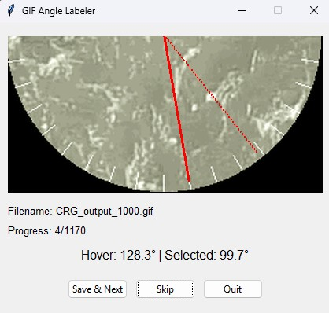

# GIF Angle Labeling Tool

A simple Python GUI tool to assist in labeling the general direction of movement in animated GIFs of semicircles. The tool allows for mouse-based angle selection and automatically saves progress.




## Notes about make_gif.py

Generates a GIF animation from a sequence of image frames and overlays coordinates specified in a JSON file.

Note:
- To use this script, you need a JSON file containing the coordinates to overlay.
- You also need the image frames to be included in the GIF.

## Installation & Setup

Follow these steps to get the tool running.

### 1. Prerequisites

-   You must have **Python 3.6** or newer installed. You can check your version by running `python --version` or `python3 --version` in your terminal.

### 2. Folder Structure

Create a main project folder and organize your files as shown below. The Python script should be in the main folder, and all your GIFs must be placed inside a subfolder named `gifs`.

```bash
angle_labeler/
├── label_angles.py    # The main Python script
├── README.md          # This file
└── gifs/              # Folder for all your GIFs
    ├── data_01.gif
    ├── data_02.gif
    └── ...
```

### 3. Set Up a Virtual Environment (Highly Recommended)

Using a virtual environment keeps your project's dependencies isolated from your system's Python.

Navigate to your project folder (`angle_labeler/`) in your terminal and run:

```bash
# Create the virtual environment folder named 'venv'
python -m venv venv
```
Now, activate the environment:
- On Windows (Command Promt of PowerShell)
```bash
.\venv\Scripts\activate
```
- On macOS and Linux:
```bash
source venv/bin/activate
```
Your terminal prompt should now be prefixed with (venv), indicating the environment is active.
### 4. Install Dependencies
With your virtual environment active, install the required Pillow library:

```bash
pip install Pillow

# or

pip install -r requirements.txt
```

## How to use the tool
1. **Run the script**: Make sure your virtual environment is active, then run the script from the main project directory:
```bash
python label_angles.py
```
2. **Select an angle**:
    - The application window will appear, displaying the first unlabeled GIF.
    - Move your mouse over the window. A **dotted red line** will follow your cursor, indicating the current angle.
    - **Left-click** on the image to set the angle. A **solid red line** will appear, locking in your choice.
    - If you make a mistake, simply click again to select a new angle.

3. **Save or Skip:** 
    - **Save & Next**: Once you are satisfied with the selected angle, click this button. The filename and angle will be saved to labels.csv, and the next GIF will load.
    - **Skip**: If a GIF is unclear or you want to ignore it for now, click this button. The tool will move to the next GIF without saving anything.
    - **Quit**: Closes the application. Your progress is already saved, so you can quit at any time.